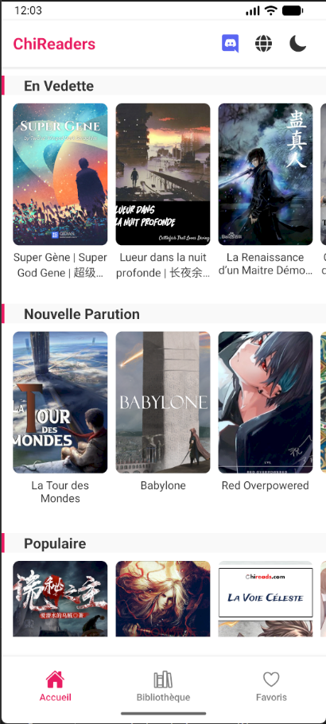

# ChiReader 📱

Application Android pour lire des romans (web novels) depuis le site **chireads.com** directement sur votre tablette ou smartphone Android.



## ✨ Fonctionnalités

- **📚 Catalogue complet** : Accès aux romans "En Vedette" et "Dernières Mises à Jour"
- **🔍 Recherche Instantanée** : Recherchez vos romans préférés instantanément (supporte les accents et la recherche floue)
- **❤️ Favoris** : Sauvegardez vos romans préférés pour un accès rapide
- **🕐 Suivi de lecture** : Reprenez votre lecture exactement là où vous l'avez laissée
- **📖 Lecteur optimisé** : 
    - Mode Jour / Nuit / Sépia 📜
    - Ajustement de la taille de police (A+ / A-)
    - Navigation par swipe entre chapitres
    - Barre de progression de lecture
    - Interface adaptée aux tablettes
- **🔔 Notifications** : Activez les notifications pour vos séries favorites (cloche sur l'écran Favoris)
- **🎯 Continuer la lecture** : Accès rapide aux romans en cours

---

## 🛠 Installation et Développement

### Prérequis

- **Node.js** (version 18 ou supérieure) : [Télécharger](https://nodejs.org/)
- **Git** : [Télécharger](https://git-scm.com/)
- **Android Studio** (pour test sur émulateur/appareil physique) : [Télécharger](https://developer.android.com/studio)

### 1. Installation des dépendances

```bash
# Clone du repository (si pas déjà fait)
git clone <url-du-repo>
cd chireaders

# Installation des dépendances
npm install
```

### 2. Configuration d'Android Studio

#### Option A : Émulateur Android

1. **Ouvrir Android Studio**
2. **Créer un émulateur** :
   - Allez dans `Tools` → `Device Manager`
   - Cliquez sur `Create Device`
   - Choisissez une tablette (ex: Pixel Tablet) ou un téléphone
   - Sélectionnez une image système (recommandé : Android 13/14)
   - Terminez la création
3. **Lancer l'émulateur** en cliquant sur le bouton ▶️

#### Option B : Appareil Physique

1. **Activer le mode développeur** sur votre appareil :
   - Allez dans `Paramètres` → `À propos du téléphone`
   - Tapez 7 fois sur `Numéro de build`
2. **Activer le débogage USB** :
   - Allez dans `Paramètres` → `Système` → `Options pour les développeurs`
   - Activez `Débogage USB`
3. **Connecter l'appareil** avec un câble USB
4. **Autoriser le débogage** sur l'appareil quand demandé

#### Vérification de la connexion

```bash
# Vérifier que l'appareil est détecté
adb devices

# Résultat attendu :
# List of devices attached
# emulator-5554   device
# OU
# xxxxxxxx    device
```

### 3. Lancement de l'application

#### Mode développement (avec Expo)

```bash
# Démarrer le serveur de développement
npm start

# OU avec cache vidé (recommandé en cas de problème)
npm start -- --clear
```

Une fois le serveur démarré :
- **Pour émulateur** : Appuyez sur `a` dans le terminal
- **Pour appareil physique** : Scannez le QR code avec l'app **Expo Go** (Play Store)

#### Commandes utiles

```bash
# Lancer directement sur Android
npm run android

# Lancer sur iOS (nécessite Mac)
npm run ios

# Lancer sur web
npm run web
```

---

## 📋 Suivi du Projet

### ✅ Fonctionnalités Implémentées

- [x] **Scraper chireads.com** fonctionnel
- [x] **Page d'accueil** avec romans en vedette et derniers ajouts
- [x] **Recherche de romans** par titre
- [x] **Système de favoris** avec persistance
- [x] **Suivi de progression** de lecture
- [x] **Lecteur ePub-like** optimisé pour tablettes
  - [x] Mode jour/nuit
  - [x] Ajustement taille de police
  - [x] Navigation swipe
  - [x] Barre de progression
- [x] **Écran favoris** complet
- [x] **Continuer la lecture** depuis l'accueil

### 🚧 En Cours / Améliorations Futures

- [x] **Mode paysage** optimisé pour tablettes
- [x] **Notifications** de nouveaux chapitres
- [x] **Sélection de texte** et copie (comme sur navigateur)
- [x] **Historique** (via suivi des chapitres lus)

### 🐛 Problèmes Connus

| Problème | Statut | Solution temporaire |
|----------|--------|---------------------|
| CORS sur navigateur web | ✅ Normal | Utiliser l'app Android/émulateur |
| Temps de chargement longs | 🔄 Optimisation en cours | Patienter pendant le chargement |
| Certains romans sans image | 🔄 Investigation | Placeholder affiché automatiquement |

---

## 📦 Génération de l'APK (Android)

### Méthode 1 : Avec Expo EAS (Recommandé)

```bash
# 1. Installer EAS CLI
npm install -g eas-cli

# 2. Se connecter à Expo
eas login

# 3. Configurer le projet
eas build:configure

# 4. Lancer le build (APK de preview)
eas build -p android --profile preview

# 5. Pour un APK de production
eas build -p android --profile production
```

Le fichier APK sera disponible en téléchargement à la fin du build.

### Méthode 2 : Build local avec Android Studio

```bash
# 1. Prébuild du projet
npx expo prebuild -p android

# 2. Ouvrir dans Android Studio
# Le dossier android/ a été créé

# 3. Dans Android Studio :
#    - Build → Generate Signed Bundle/APK
#    - Choisir APK
#    - Créer ou sélectionner un keystore
#    - Build → Build Bundle(s) / APK(s) → Build APK(s)
```

### Installation de l'APK

1. Transférez le fichier `.apk` sur votre appareil
2. Activez `Sources inconnues` dans les paramètres de sécurité
3. Installez l'APK
4. Profitez de la lecture ! 📚

---

## 🗂️ Structure du Projet

```
chireaders/
├── src/
│   ├── screens/
│   │   ├── HomeScreen.js          # Page d'accueil
│   │   ├── NovelDetailScreen.js   # Détails d'un roman
│   │   ├── ReaderScreen.js        # Lecteur de chapitre
│   │   └── FavoritesScreen.js     # Liste des favoris
│   ├── services/
│   │   ├── ChiReadsScraper.js     # Scraper du site
│   │   └── BackgroundNotificationTask.js # Tâche de fond pour notifications
│   └── context/
│       └── StorageContext.js      # Gestion des données locales
├── App.js                         # Point d'entrée
├── metro.config.js               # Configuration Metro
├── app.json                      # Configuration Expo (+ plugins)
└── package.json
```

---

## 🆘 Dépannage

### Erreur "Unable to resolve module"

```bash
# Vider le cache
npm start -- --clear

# OU
npx expo start --clear
```

### L'émulateur ne se lance pas

1. Vérifiez qu'Android Studio est ouvert
2. Vérifiez dans le Device Manager que l'émulateur existe
3. Essayez de lancer l'émulateur depuis Android Studio d'abord
4. Redémarrez Android Studio si nécessaire

### Problèmes de connexion réseau

L'application ne fonctionne pas dans le navigateur web à cause des restrictions CORS de chireads.com. Utilisez impérativement :
- L'émulateur Android
- Un appareil physique Android
- L'application Expo Go

### Reset complet

```bash
# Si tout semble bloqué
npm run reset-project
npm install
npm start -- --clear
```

---

## 📱 Compatibilité

- **Minimum Android** : Android 8.0 (API 26)
- **Recommandé** : Android 10+ (API 29+)
- **Tablettes** : Optimisé pour écrans 7" et plus

---

## 🤝 Contribution

Ce projet est personnel mais les suggestions sont les bienvenues !

## 📝 Notes de développement

- **Dernière mise à jour** : Février 2026
- **Version** : 1.5.1
- **Stack** : React Native + Expo + Cheerio

---

*Développé avec ❤️ pour les lecteurs de ChiReads.*


### ⚠️ Deprecation Notice
The branch `bolt/optimize-images` is superseded by v1.5.2 integration.
